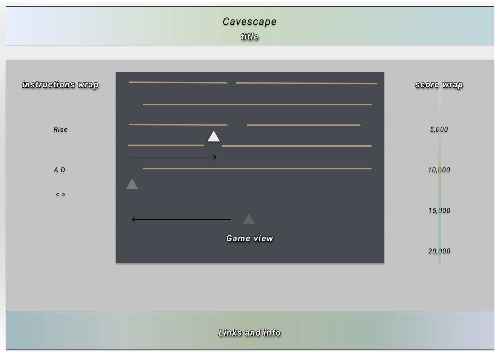

# Cavescape

## Background
  The player controls an avatar that is automatically rising to the top of the screen at a set rate. Quick relfexes will allow the player to survive without getting pushed to the bottom of the screen by falling obstacles. Working title is Cavescape, with a planned theme of rising up out of the water.

## Functions & MVP

  - [ ] Page will open with instructions and a game board
  - [ ] Player will be able to control sideways movement of avatar
  - [ ] Player will automatically head directly to the top of the screen
  - [ ] Obstacles the player must get through will fall from the top of the screen
  - [ ] Will have a production README with GIFs and code

## Wireframe base

## Technologies anticipated
  Canvas, mostly Vanilla Javascript, with Easel.js, html, and CSS.

### There will be three scripts involved
  * `board.js` for all the game logic and setup
  * `avatar.js` for handling the drawing and movement of the player's avatar
  * `obstacles.js` for rendering the falling obstacles

## Implementation Timeline

### Day 1: Set up initial canvas and some base functionality

**Objective:** Learn Canvas and Easel basics
  - drawing of the avatar and board
  - basic styling for the app and avatar
  - add basic instructions to the screen

### Day 2: Implement movement & obstacle logic

**Objective:** Instantiate movement and random obstacle drawing
  - avatar can move left and right
  - obstacles will have enough random gaps to be challenging
  - basic styling for the obstacles

### Day 3: Forge objective consequences

**Objective:** Get obstacles falling on the screen
  - work out timing of obstacles
  - work out speed of player avatar
  - make game end if player gets pushed to the bottom by an obstacle

### Day 4: Further stylize balance game

  **Objective:** Complete Game
  - implement time/distance-based score
  - make sure game works by the end of the day
  - make sure game is fun

### Bonus Features (TBD)
  - [ ] Traps for the player to drop downward out of with `S` or `down arrow key`
  - [ ] Increasing levels of complexity and complications
  - [ ] "Levels" with background changes as time goes on and the difficulty jumps
